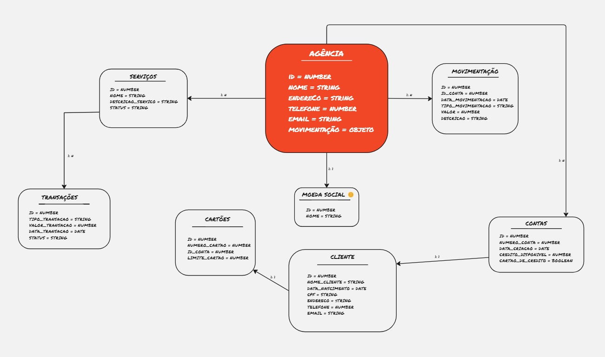

## Banco SOS - Seu Banco Comunitário


Este projeto consiste em um Banco comunitário e será desenvolvido durante a Imersão JavaScript com AWS da Reprograma.


🚧 Em construção 🚧


**Sobre o projeto:**
Bancos comunitários são serviços financeiros solidários que visam gerar trabalho e renda, promovendo o desenvolvimento de economias locais, especialmente em territórios de baixa renda, por meio do apoio à economia popular e solidária.


**Serviços financeiros oferecidos pelo banco comunitário:**
-  Crédito para financiamento de empreendimentos solidários.
- Crédito para consumo pessoal e familiar, sem juros.
- Cartão de crédito popular solidário.
- Abertura e extrato de conta corrente.
- Depósito em conta corrente.
- Saque avulso ou com cartão magnético.
- Pagamento de contas (água, luz, telefone etc.).
- Recebimento de aposentadorias e outros valores governamentais
- Gerentes da conta
- Prestação de contas diário e semanal para toda a comunidade
- Desafio extra: Moeda social circulante local.


**Modelagem do Banco Comunitário**
-



**Segunda Semana - POO com Typescript**
-


Para executar o projeto utilize os seguintes comandos:


```bash
npm run build
npm start
```

**Terceira Semana - API com Nestjs**
-


[Nest](https://github.com/nestjs/nest) framework TypeScript starter repository.

### Installation

```bash
$ npm install
```

### Running the app

```bash
# development
$ npm run start

# watch mode
$ npm run start:dev

# production mode
$ npm run start:prod
```

### Test

```bash
# unit tests
$ npm run test

# e2e tests
$ npm run test:e2e

# test coverage
$ npm run test:cov
```

### Support

Nest is an MIT-licensed open source project. It can grow thanks to the sponsors and support by the amazing backers. If you'd like to join them, please [read more here](https://docs.nestjs.com/support).

### Stay in touch

- Author - [Kamil Myśliwiec](https://kamilmysliwiec.com)
- Website - [https://nestjs.com](https://nestjs.com/)
- Twitter - [@nestframework](https://twitter.com/nestframework)

### License

Nest is [MIT licensed](LICENSE).
